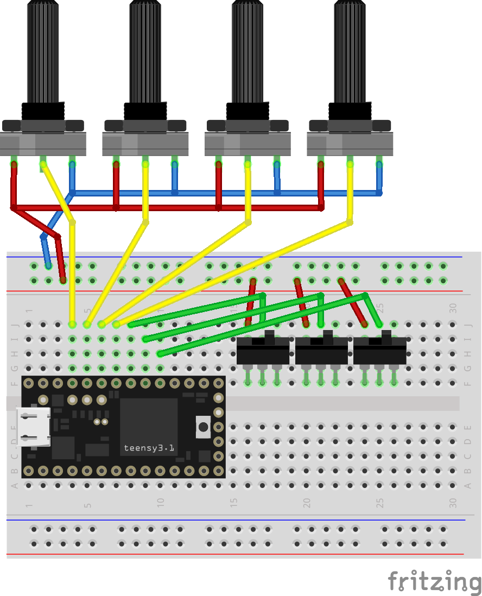

# SuperCollider-SerialCtl

This is a hardware-controller, designed to interface with SuperCollider through USB.
  
Other than (standard) MIDI, tty-serial offers faster baudrates and higher resolution.  

I have only tested it in SuperCollider 3.12 on Ubuntu GNU/Linux, but I'm sure this device can interface with other applications, like PureData, that can read from Serial. 

## Prerequisites

### Software

- [SuperCollider](https://github.com/supercollider/supercollider)
- [Visual Studio Code](https://code.visualstudio.com/)
- [PlatformIO for VSCode](https://docs.platformio.org/en/latest/integration/ide/vscode.html)

### Hardware

*Please note that [Teensy 3.2](https://www.pjrc.com/store/teensy32.html) was used, despite teensy3.1 in the schematic.*

- Pots 10k linear
- Toggle-Switches

## Todo

- find a more elegant way to break out the micro-USB
- reduce bytes per Message (possibly by 2)
- Serial.read() & Value Pickup